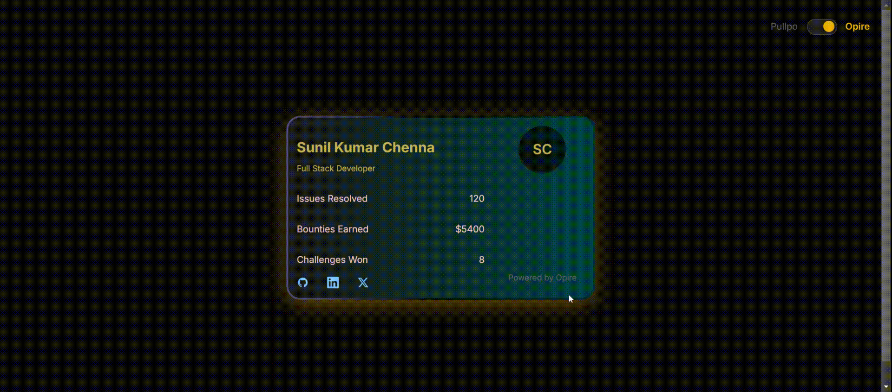

# Opire Dev Card

A modern, animated developer card component built for the Opire Dev ID Card Challenge. This component creates visually appealing cards that showcase developer statistics and achievements.



## 🌟 Features

- Clean and modern design with gradient animations
- Theme switching between Pullpo and Opire styles
- Animated border effects
- Social media links integration
- Responsive avatar display
- Dynamic stats presentation
- Built with React and TypeScript
- Zero external dependencies beyond core requirements

## 🚀 Live Demo

<a href="https://animated-id-card.vercel.app/" target="_blank">View Live Demo</a>

## 🛠️ Tech Stack

- React 18
- TypeScript
- Mantine UI
- CSS Animations
- SVG Icons

## 📦 Installation

1. Clone the repository:
```bash
git clone https://github.com/sunilkumar27/animated-id-card.git
cd opire-dev-card
```

2. Install dependencies:
```bash
npm install
```

3. Start the development server:
```bash
npm run dev
```

## 💻 Usage

```tsx
import { DevCard } from './components/DevCard';

const profile = {
  userInfo: {
    id: '1',
    name: 'John Doe',
    role: 'Full Stack Developer',
    level: 'Pro',
    initials: 'JD',
  },
  stats: {
    issuesResolved: 120,
    bountiesEarned: 5400,
    challengesWon: 8,
  },
  socialLinks: {
    github: 'https://github.com',
    x: 'https://x.com',
    linkedin: 'https://linkedin.com'
  },
};

function App() {
  return <DevCard {...profile} themeType="opire" />;
}
```

## 🎨 Theme Customization

The card supports two built-in themes: 'pullpo' and 'opire'. Themes can be switched using the `themeType` prop:

```tsx
<DevCard {...profile} themeType="pullpo" />
<DevCard {...profile} themeType="opire" />
```

## 📁 Project Structure

```
src/
├── components/
│   ├── DevCard/
│   │   ├── DevCard.tsx
│   │   ├── DevCard.types.ts
│   │   ├── DevCardAvatar.tsx
│   │   └── DevCardSocial.tsx
│   └── ThemeToggle/
│       ├── ThemeToggle.tsx
│       └── ThemeToggle.css
├── styles/
│   └── theme.ts
├── App.tsx
├── main.tsx
└── main.css
```

## 🤝 Contributing

Contributions are welcome! Feel free to:

1. Fork the repository
2. Create a new branch: `git checkout -b feature/awesome-feature`
3. Make your changes
4. Push your branch: `git push origin feature/awesome-feature`
5. Open a Pull Request

## 📄 License

This project is licensed under the MIT License - see the [LICENSE](LICENSE) file for details.

## 🙏 Acknowledgments

- Challenge provided by [Opire](https://opire.dev)
- Design inspiration from [Pullpo](https://pullpo.io/products/devcard)

---
Built with ❤️ for the Opire Dev ID Card Challenge
